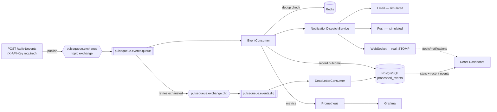

<div align="center">

# PulseQueue

### Notification infrastructure — a RabbitMQ-backed pipeline with retry, dead-lettering, Redis dedup/rate-limiting, an API-key-guarded ingress and full observability

[](https://openjdk.org/)
[](https://spring.io/projects/spring-boot)
[](https://spring.io/projects/spring-security)
[](https://www.rabbitmq.com/)
[](https://redis.io/)
[](https://react.dev/)
[](https://prometheus.io/)
[](https://grafana.com/)
[](https://www.docker.com/)
[](#license)

</div>

---

## 📖 About the project

**PulseQueue is not a notification CRUD app — it's the infrastructure layer other services publish to.** Any producer that can reach RabbitMQ with a valid API key can hand off a domain event (`expense.created`, `donation.created`, or any future type) and walk away: PulseQueue owns everything from that point on — queueing, retrying with backoff, dead-lettering what can't be delivered, deduplicating redeliveries, rate-limiting noisy producers, and fanning the event out to Email, Push and WebSocket — while a live, ops-style dashboard shows exactly what the pipeline is doing in real time.

```
CashPilot
    │
    ▼
RabbitMQ
    │
    ▼
PulseQueue
    │
 ┌──────────┼──────────┐
 ▼          ▼          ▼
Email   WebSocket    Push
```

That's the pitch this repo is built to demonstrate: a producer publishes and moves on — it never knows or cares how the notification actually gets delivered, retried, or recovered. This repo ships **standalone** with its own `POST /api/v1/events` ingress and a `/simulate` endpoint publishing sample `ExpenseCreated`/`DonationCreated` events, so the pipeline is fully demoable without CashPilot or Social Supply actually running — but the diagram above is the real intent: any of those services could be the producer for real with zero changes on this side.

| Package | Description | Docs |
|---|---|---|
| [`backend/`](backend) | Spring Boot 3 API — RabbitMQ producer/consumer, retry + DLQ, Redis dedup/rate-limit/cache, API-key security, Micrometer metrics | [backend source](backend/src/main/java/com/pulsequeue) |
| [`frontend/`](frontend) | React + TypeScript dashboard — Kibana-style dark ops view: publish/process/DLQ/retry/consumer/broker-health tiles, recent events, WebSocket feed | [frontend source](frontend/src) |
| [`monitoring/`](monitoring) | Prometheus scrape config + Grafana datasource/dashboard provisioning | |

---

## ✨ Features

```
✅ RabbitMQ producer / consumer

✅ Retry with exponential backoff

✅ Dead Letter Queue

✅ API-key-guarded ingress (Spring Security)

✅ Email notifications (simulated)

✅ Push notifications (simulated)

✅ Real-time WebSocket notifications

✅ Redis deduplication

✅ Redis rate limiting

✅ Cached dashboard stats

✅ Prometheus metrics

✅ Grafana dashboards

✅ Health checks

✅ Docker

✅ CI/CD
```

---

## 🚀 Quick start (full stack, with Docker)

```bash
git clone https://github.com/duanjesus/pulsequeue.git
cd pulsequeue
docker compose up --build
```

| Service      | URL                                    |
|--------------|------------------------------------------|
| Dashboard    | http://localhost:3000                    |
| API          | http://localhost:8080                    |
| Swagger      | http://localhost:8080/swagger-ui.html    |
| RabbitMQ UI  | http://localhost:15672 (pulsequeue/pulsequeue) |
| Prometheus   | http://localhost:9090                    |
| Grafana      | http://localhost:3001 (admin/admin)      |

Open the dashboard, click **Simulate events** to publish a couple of sample `expense.created`/`donation.created` events, and watch the tiles and live feed update. Click **Simulate failure** to publish an event with a `simulateFailure` flag — it exhausts its retries (visible ticking up in real time) and lands on the dead-letter queue, which you can also watch happen live in the RabbitMQ management UI.

## 🧪 Local development (without Docker)

```bash
# 1. Infra only
docker compose up -d db rabbitmq redis

# 2. Backend (terminal 1)
cd backend
mvn spring-boot:run

# 3. Frontend (terminal 2)
cd frontend
npm install
npm run dev
```

Frontend dev server: http://localhost:5173 (Vite proxies `/api` and `/ws` to `http://localhost:8080`).

Backend tests include a Testcontainers-based integration test that spins up real Postgres/RabbitMQ/Redis containers — it needs a working Docker daemon to run (`mvn test`), same as anything using Testcontainers.

---

## 🔐 Security

`POST /api/v1/events` and `/api/v1/events/simulate` require an `X-API-Key` header matching `pulsequeue.security.api-key` (env var `API_KEY`, defaults to a documented dev key — override it for anything beyond local demo use). Everything else — the dashboard's read endpoints, actuator, Swagger — stays open, since the point is guarding *who can publish*, not gating the whole app behind a login. See the note in `SecurityConfig`/`ApiKeyAuthFilter` for why this is a filter-level shared secret rather than full user auth.

---

## 🏗️ Architecture



**The retry + DLQ path:** `pulsequeue.events.queue` is declared with `x-dead-letter-exchange` pointing at `pulsequeue.exchange.dlx`. A Spring AMQP `RetryOperationsInterceptor` wraps the consumer, retrying a failing message in-process (exponential backoff) up to `pulsequeue.retry.max-attempts` times; once exhausted, `RejectAndDontRequeueRecoverer` rejects the message, and RabbitMQ routes it to the DLX automatically. A separate `DeadLetterConsumer` listens on the DLQ purely to record the terminal `DEAD_LETTERED` outcome for the dashboard.

**Deduplication is check-before / mark-after-success, not claim-then-process:** the Redis key for an eventId is only set once processing actually succeeds. Claiming it up front would make every in-process retry of a currently-failing delivery look like a duplicate of itself and get silently skipped instead of retried — see the note in `DeduplicationService`.

---

## 📊 Dashboard

The dashboard is deliberately built to read like an ops tool (Kibana/Grafana-style dark UI), not a CRUD admin panel — six primary tiles up top: **Messages Published, Messages Processed, Dead Letter Queue, Retry Queue, Consumers, RabbitMQ Status** (a live green/red broker-health pill), backed by a recent-events table and a real-time WebSocket feed underneath.

---

## 🗺️ Roadmap

- [x] **V1** — Producer, consumer, queue, retry with exponential backoff, Dead Letter Queue
- [x] **V2** — Email, Push (simulated) and real WebSocket notification channels
- [x] **V3** — Redis-backed deduplication, per-source rate limiting, cached dashboard stats
- [x] **V4** — Micrometer metrics, Prometheus scrape endpoint, provisioned Grafana dashboard, Actuator health checks
- [x] **V5** — Spring Security API-key ingress, Consumers/RabbitMQ-health dashboard tiles, Kibana-style dark UI, rename to PulseQueue

---

## 🏗️ Repository layout

```
pulsequeue/
├── backend/                     Spring Boot API (Java 21, RabbitMQ, Redis, PostgreSQL/Flyway, Spring Security)
│   ├── src/main/java/com/pulsequeue/
│   │   ├── config/              RabbitMQ, WebSocket, typed @ConfigurationProperties
│   │   ├── security/            ApiKeyAuthFilter, SecurityConfig
│   │   ├── event/                DomainEvent record
│   │   ├── producer/            EventPublisher
│   │   ├── consumer/            EventConsumer, DeadLetterConsumer
│   │   ├── notification/        NotificationChannel + Email/Push/WebSocket impls
│   │   ├── service/              EventProcessingService, Deduplication/RateLimit/DashboardStats
│   │   ├── entity/ repository/   ProcessedEvent (Postgres, one row per eventId)
│   │   ├── controller/          EventController, DashboardController
│   │   └── metrics/              EventMetrics (Micrometer counters/timer)
│   ├── src/test/java/            Unit tests (JUnit5+Mockito) + PulseQueueIntegrationTest (Testcontainers)
│   ├── pom.xml
│   └── Dockerfile
├── frontend/                    React + TypeScript dashboard (Vite, Tailwind, TanStack Query, STOMP.js)
├── monitoring/
│   ├── prometheus/prometheus.yml
│   └── grafana/provisioning/    Datasource + one provisioned dashboard (PulseQueue Overview)
├── docker-compose.yml           db + rabbitmq + redis + api + web + prometheus + grafana
└── .github/workflows/ci.yml     Backend (Maven+Testcontainers) + Frontend (npm) jobs
```

---

## 🌱 Commit convention

This project follows **Conventional Commits** (`feat`, `fix`, `refactor`, `docs`, `style`, `test`, `chore`).

---

## 📄 License

Distributed under the MIT License. See `LICENSE` for more information.
